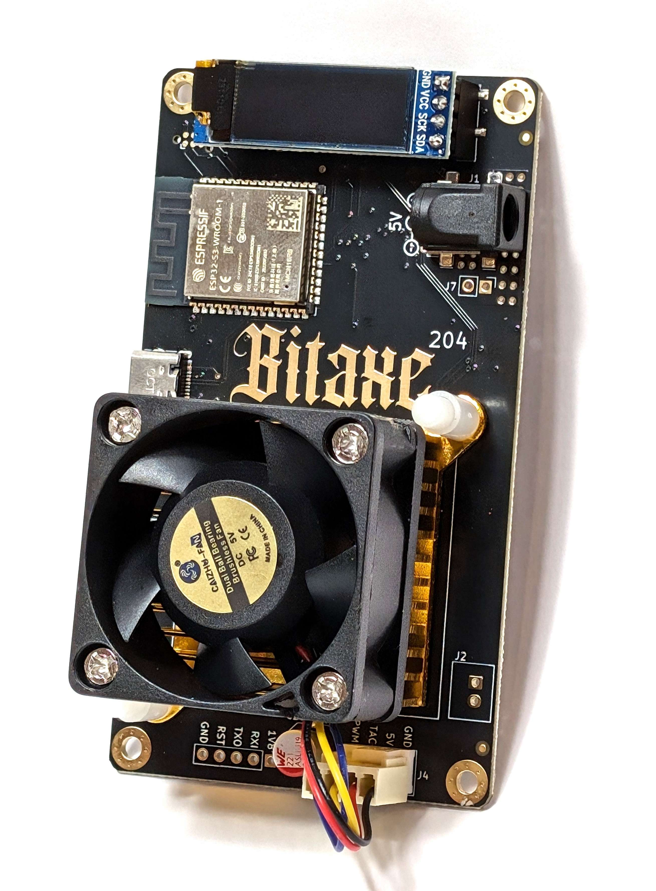

```
Open Source is Intrinsic to Bitcoin
```
# The bitaxeUltra
bitaxe is a fully open source hardware Bitcoin ASIC miner. Ultra is the 3rd major revision of the bitaxe that now includes the BM1366 ASIC from the S19XP



## Goals
- **Standalone**: can mine directly to your pool over WiFi. No External computer needed.
- **Embedded**: low cost, low maintenance, high availability, high reliability, low power.
- **ASIC**: based on the very, very efficient BM1366 from Bitmain.
- **Versatile**: solo/pool mining, autotune power/heat/efficiency.
- **Open Source**: All design files are provided.

## Features
- **ESP32-S3-WROOM-1** wifi microcontroller on board
- **TI TPS40305** buck regulator steps down the 5V input to power the BM1366
- **Maxim DS4432U+** current DAC digitally adjusts the BM1366 core voltage from 0.04V to 2.4V
- **TI INA260** power meter measures the input voltage and current of the miner
- **Microchip EMC2101** PWM controls the fan and monitors tach output. BM1366 doesn't support die temp, but we have it placed super close to the ASIC so we can use the internal temp feature.
- 0.91" **SSD1306 OLED** I2C Display Module 

## BM1366
- The BM1366 is a undocumented SHA256 mining ASIC from Bitmain. It's used in the Antminer S19XP and the S19k Pro
- Bitmain claims the BM1366 has 0.021J/GH efficiency
- The BM1366 is available (new) for around $15 each in small quantities.
- The BM1366 has a different footprint and pinout from the BM1397 and BM1387 in previous bitaxe.
- The BM1366 appears to roll more than just the nonce on the chip. This is great news, because it allows much longer serial chains of ASICs and new work doesn't need to be sent as often.

## Current Status
- Bitaxe Ultra 204 hardware has been verified and is working nicely!
- Be sure to check the [issues](https://github.com/skot/bitaxe/issues) for known bugs, reworks and errata.
- This is an _advanced_ build! You can do it, but if you're not looking for a project, it might be best to buy one pre-assembled from one of the many sellers.

## Hardware
- Order PCBs from your favorite PCB shop, like [JLCPCB](https://jlcpcb.com), [SeeedStudio](https://www.seeedstudio.com/fusion_pcb.html), or [PCBWay](https://www.pcbway.com)
    - Gerbers are in the `Manufacturing Files` dir. PCBs are 4-layer, 6mil trace/space and 0.3mm hole compatible. 1oz outer / 0.5oz inner layer thickness works well.
    - Make sure to order stencils too. These are the "paste" layers in the gerbers folder. one for top and one for bottom.
- All PCB parts except the ASIC are available from [DigiKey](https://www.digikey.com/en/products) and others. You can find Digikey part numbers on the DK tab of the BOM
- [BM1366 ASIC from NBTC on AliExpress](https://www.aliexpress.us/item/3256804709142138.html). I got the "AG" variant. Not really sure what the difference is -- "AL" works also.
- [40x40mm heatsink and 5V fan](https://www.aliexpress.com/item/2251832861666365.html) from a random AliExpress seller. The fans are crap, but the heatsinks are good. **make sure** to use a good quality thermal compound between the heatsink and ASIC!
- Upgrade your fan with the [Noctua NF-A4x10](https://noctua.at/en/products/fan/nf-a4x10-pwm) 5V 4-Pin fan for a much more pleasant experience.
- Supports 0.91" SSD1306-based I2C OLED Module. [Example Amazon seller](https://www.amazon.com/gp/product/B08ZY4YBHL)
- [KiCad 7](https://www.kicad.org) design files

## Software
- The [ESP-Miner](https://github.com/skot/ESP-Miner) firmware used for the BM1397-based bitaxe has been adapted for the BM1366 and the current main branch can support both.

## Cooling
- You **must** have active cooling on the bitaxe. 
- The Bitaxe has a connector for a 5V fan. 40x40mm fans work nicely with the suggested heatsink
- The fan connector uses the 4-pin standard:
	- 2 pins are for 5V power
	- pin 3 is fan speed sensing
	- pin 4 is fan speed control (PWM) 

## Power Supply Requirements
- **5V DC Only!** Anything else will damage the Bitaxe. Be careful and double-check your power supply is 5V. Many other voltage power supplies use the same connector.
- [5VDC Power supply](https://www.amazon.com/BTF-LIGHTING-Plastic-Adapter-Transformer-WS2812B/dp/B01D8FM4N4). Should be capable of over 15W
- The bitaxe uses a 5.5x2.5mm, center-positive barrel jack.

### ESP32 Programming Requirements
- As of the bitaxeUltra, all ESP32 programming is done through a USB-C cable and connector on the bitaxe. See [ESP-Miner](https://github.com/skot/ESP-Miner) for more details.

## Building
- Check out [building.md](building.md) for PCB ordering tips
- Check out [assembly.md](assembly.md) for assembly tips
